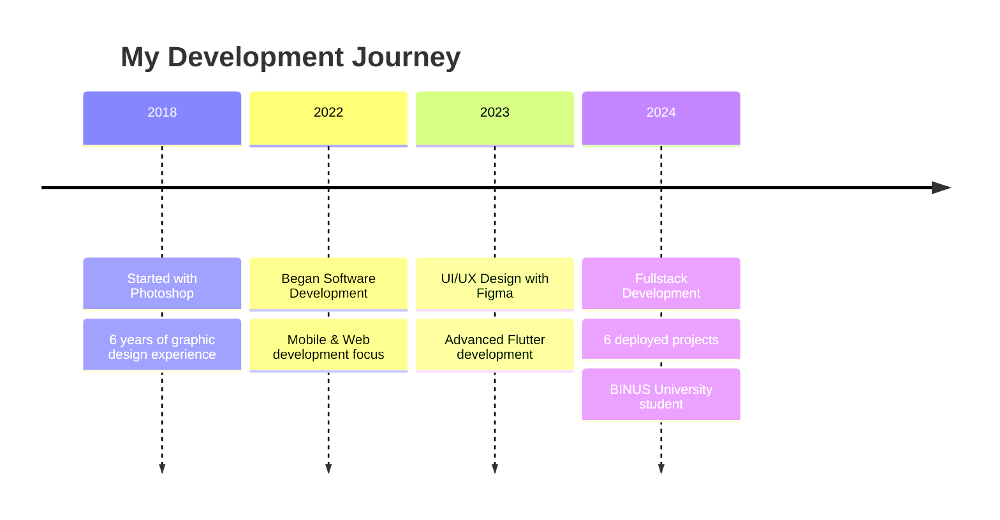

<!-- Custom Header with Animated Background -->
<div align="center">
  
</div>

<div align="center">

# 👋 Howdy, I'm Glantrox


<p align="center">
  
  
  
  
</p>

</div>

---

## 🚀 Command Palette

<table width="100%">
<tr>
<td width="50%" valign="top">

### 💻 Current Status
```yaml
role: "Fullstack Developer"
focus: 
  - Mobile App Development (Flutter)
  - Web Applications (React/Next.js)
  - UI/UX Design (Figma)
  - Backend Services (Express.js)

current_projects:
  - attendme_app (Flutter)
  - meal_planner_web (JavaScript)
  - portfolio_remake_web (HTML/CSS/JS)
  
learning: "Advanced Flutter & Cloud Architecture"
```

</td>
<td width="50%" valign="top">

### 📊 Quick Stats
```yaml
deployed_projects: 6
platforms: ["Mobile", "Web", "Desktop"]
design_experience: "6 years (Photoshop)"
ui_ux_experience: "1 year (Figma)"
favorite_stack: "Flutter + Express.js"
timezone: "UTC+07:00 (Jakarta)"
```

</td>
</tr>
</table>

---

## 🛠 Tech Arsenal

<div align="center">

### 📱 Mobile Development
<table>
<tr>
<td align="center" width="120">

<br><sub><b>Flutter</b></sub>
</td>
<td align="center" width="120">

<br><sub><b>Dart</b></sub>
</td>
<td align="center" width="120">

<br><sub><b>Android Studio</b></sub>
</td>
</tr>
</table>

### 🌐 Web Development
<table>
<tr>
<td align="center" width="100">

<br><sub><b>HTML5</b></sub>
</td>
<td align="center" width="100">

<br><sub><b>CSS3</b></sub>
</td>
<td align="center" width="100">

<br><sub><b>JavaScript</b></sub>
</td>
<td align="center" width="100">

<br><sub><b>Node.js</b></sub>
</td>
<td align="center" width="100">

<br><sub><b>Express.js</b></sub>
</td>
</tr>
</table>

### 🎨 Design & Creative
<table>
<tr>
<td align="center" width="120">

<br><sub><b>Figma</b></sub>
</td>
<td align="center" width="120">

<br><sub><b>Photoshop</b></sub>
</td>
<td align="center" width="120">

<br><sub><b>Video Editing</b></sub>
</td>
</tr>
</table>

</div>

---

## 📈 GitHub Analytics

<div align="center">
  
  
</div>

<div align="center">
  
</div>

---

## 🎯 Featured Projects

<div align="center">

<table>
<tr>
<td width="50%">

### 📱 AttendMe App
<div style="background: linear-gradient(135deg, #667eea 0%, #764ba2 100%); padding: 20px; border-radius: 15px; color: white;">

**Flutter Attendance System**
- 📍 Location-based attendance tracking
- 🔐 Secure authentication system
- 📊 Real-time attendance analytics
- 📱 Cross-platform mobile solution

[](https://github.com/glantrox/attendme_app)

</div>

</td>
<td width="50%">

### 🍽️ Meal Planner Web
<div style="background: linear-gradient(135deg, #f093fb 0%, #f5576c 100%); padding: 20px; border-radius: 15px; color: white;">

**Smart Meal Planning Platform**
- 🥗 Nutritional meal suggestions
- 📅 Weekly meal scheduling
- 🛒 Automated shopping lists
- 💻 Responsive web design

[](https://github.com/glantrox/meal_planner_web)

</div>

</td>
</tr>
</table>

<div align="center">
  <a href="https://github.com/glantrox/portofolio_remake_web">
    
  </a>
</div>

</div>

---

## 🎨 Design Philosophy

<table width="100%">
<tr>
<td width="33%" align="center">

### 📱 Mobile First
Building responsive, user-friendly mobile applications with Flutter's cross-platform capabilities

</td>
<td width="33%" align="center">

### 🎯 User-Centric
Crafting intuitive UX/UI designs that prioritize user experience and accessibility

</td>
<td width="33%" align="center">

### ⚡ Performance
Optimizing applications for speed, efficiency, and seamless user interactions

</td>
</tr>
</table>

---

## 🌟 Professional Journey

<div align="center">



</div>

---

## 📫 Connect with Me

<div align="center">

<table>
<tr>
<td align="center">
<a href="https://glantrox.vercel.app">

</a>
</td>
<td align="center">
<a href="https://www.instagram.com/hamasified/">

</a>
</td>
<td align="center">
<a href="https://linkedin.com/in/glantrox">

</a>
</td>
<td align="center">
<a href="mailto:your.email@domain.com">

</a>
</td>
</tr>
</table>

### 💭 "Passionate about creating digital experiences that matter"


</div>

---

<div align="center">
  
  <sub>⭐ Star my repositories if you find them interesting!</sub>
</div>
